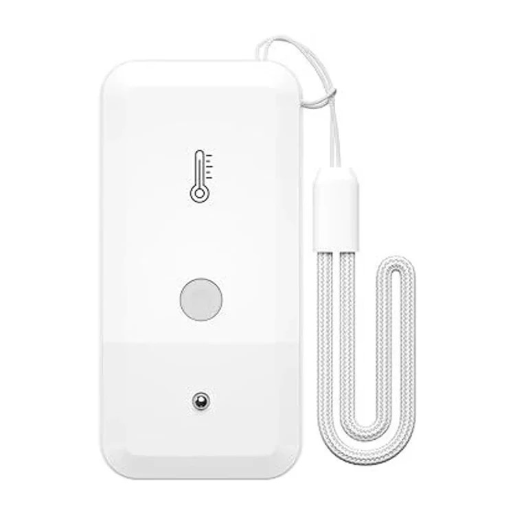
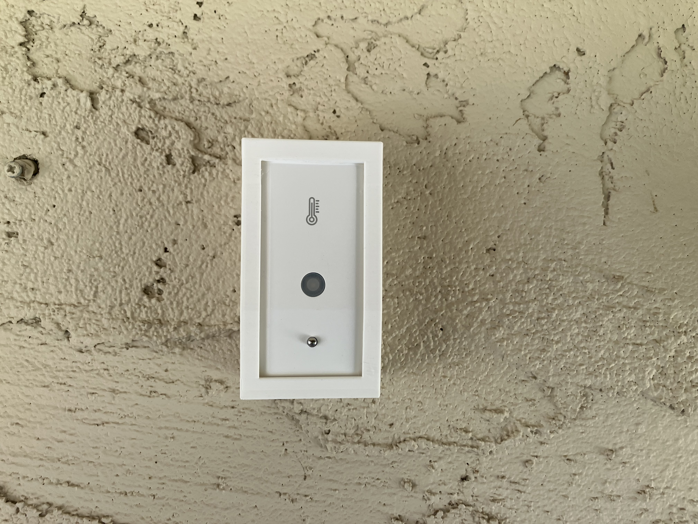
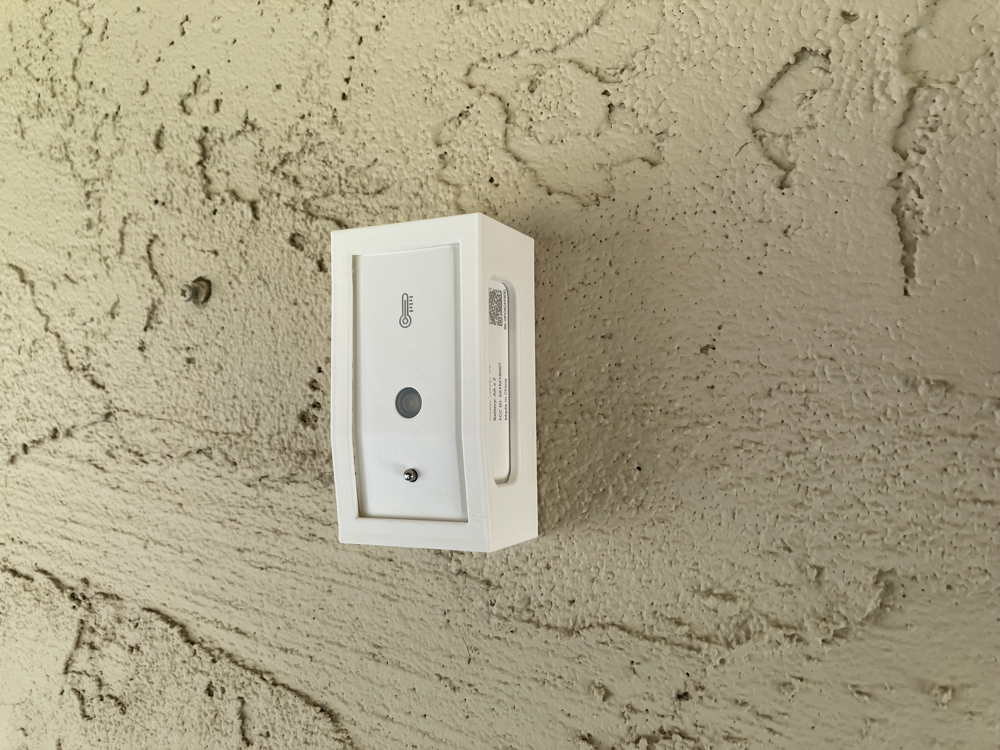
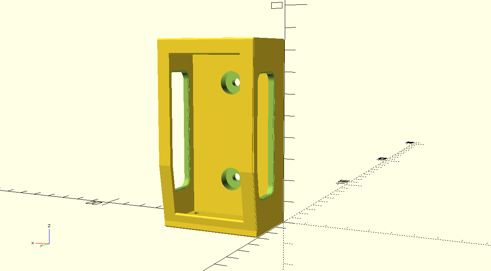

# YoLink Thermometer Cradle

A parametric, 3D-printable wall-mount cradle for the **YoLink YS8017-UC** temperature sensor.

## Purpose



The cradle holds the sensor securely on a wall while keeping it ventilated and its front display visible.

- The sensor slides into the cradle from the top.
- The cradle is meant for indoor or sheltered locations.
- **Note:** this project does not assume the YoLink sensor is weatherproof. Check the manufacturer's rating separately before using it anywhere it could get wet.

## Status

The design has been physically prototyped. The exported STL and 3MF files match the current source geometry.

### Prototype photos

<p>
  
  
</p>

## Design and features



- Open front, so the sensor's display stays visible
- Continuous left and right front retaining rails
- Bottom retaining lip
- Full-width top header that braces the front
- Asymmetric side windows for airflow:
  - the rear edge is straight and parallel to the back wall
  - the front edge follows the sensor's tapered front profile
- Four 3.0 mm drain holes through the bottom floor
- Two wall-mount screw locations, counterbored from the front

### Sensor (as measured)

| Parameter | Value |
|---|---|
| Model | YoLink YS8017-UC |
| Width | 39.0 mm |
| Height | 80.0 mm |
| Upper depth | ~24 mm |
| Lower depth | ~20 mm |
| Taper knee | 26 mm above the bottom / 54 mm below the top |

### Cradle

| Parameter | Value |
|---|---|
| Outer size | 46.2 mm W × 34.6 mm D × 85.0 mm H |
| Rear wall | 8.0 mm |
| Bottom floor | 3.0 mm |
| Side clearance | 0.6 mm per side |
| Front/profile clearance | 0.6 mm |
| Exterior edge rounding | 0.75 mm (target) |
| Drain holes | 4 × Ø3.0 mm |
| Screw locations | Z = 20 mm and Z = 65 mm, on the centreline (each 20 mm from the nearer end) |

## Mounting hardware

| Item | Specification |
|---|---|
| Screws | #6 × 1-1/2 in pan-head sheet-metal screws (2) |
| Washers | Everbilt #6 flat washer, model 800422 (2) |
| Washer OD | 9.525 mm |
| Washer thickness | 1.24 mm |
| Shank clearance hole | Ø3.9 mm |
| Washer/head counterbore | Ø10.75 mm, 5.0 mm deep |
| Material behind counterbore | 3.0 mm solid |

Screw-head dimensions vary between #6 screws, so the design does not rely on any one head height. The counterbore provides extra clearance for normal variation in #6 pan-head screw geometry.

## Printing and use

- Print upright with the bottom on the build plate.
- Verified on a Bambu Lab P1S with a 0.4 mm nozzle and 0.20 mm layer height.
- PLA/PLA+ was used successfully for prototyping and testing.
- No supports are needed in this orientation.
- The top header is a bridge of roughly 34 mm; Bambu Studio printed it as a normal bridge.
- Let the build plate cool before removing the part.
- The screw counterbores were confirmed good on the first physical print.
- Insert the sensor from the top, and check the fit before mounting the cradle permanently.

## Limitations and warnings

- Dimensions come from the one YS8017-UC unit measured for this project. Other units may vary.
- Printer accuracy and filament shrinkage can affect fit, and the front and side clearances are deliberately small.
- The drain holes are incidental. This is **not** a waterproof enclosure.
- Don't expose the sensor directly to rain or water unless the manufacturer's own rating says that's safe.
- `src/cradle.scad` is the source of truth. Regenerate the STL and 3MF exports whenever it changes.

## Development approach

The cradle is a parametric OpenSCAD model, developed through an iterative design-and-review loop:

1. ChatGPT was used to define and refine the design intent and to review the architecture.
2. Claude (Claude Code in VS Code) edited `src/cradle.scad` directly.
3. OpenSCAD's Automatic Preview gave live visual feedback. F5 was used for quick previews and F6 (CGAL render) for authoritative geometry checks.
4. Geometry was checked repeatedly with targeted boolean and probe tests.
5. Physical prototype prints were used to correct the real measurements.
6. The final STL and 3MF exports were verified against the current source geometry.

## Tools

| Tool | Use |
|---|---|
| OpenSCAD 2021.01 | Parametric CAD modelling and export |
| VS Code | Editing |
| Claude Code / Claude in VS Code | Source editing and verification assistance |
| ChatGPT | Design iteration and architecture/review |
| Bambu Studio | Slicing |
| Bambu Lab P1S, 0.4 mm nozzle | Printing |

## Repository structure

```
src/         OpenSCAD source (cradle.scad)
exports/     Print files (cradle.stl, cradle.3mf)
photos/      Product, render and prototype images
reference/   Reference CAD material (FreeCAD .FCStd)
```

## License

GNU General Public License v3.0. See [LICENSE](LICENSE).
